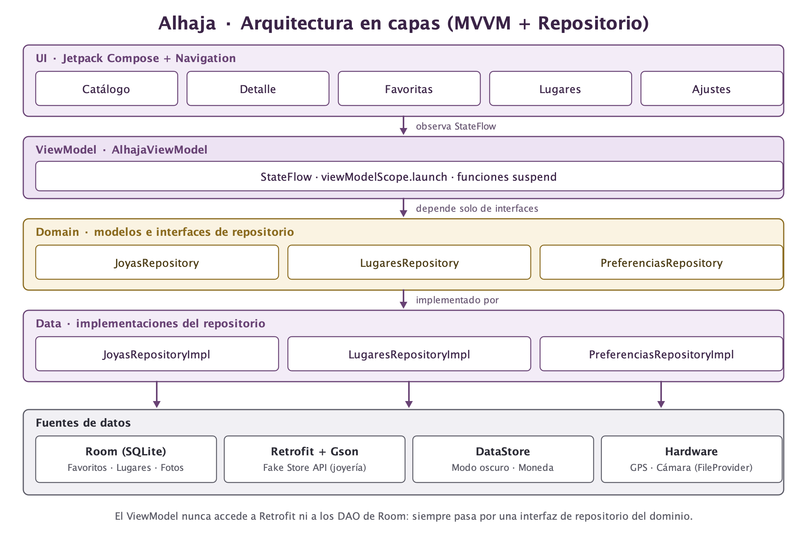
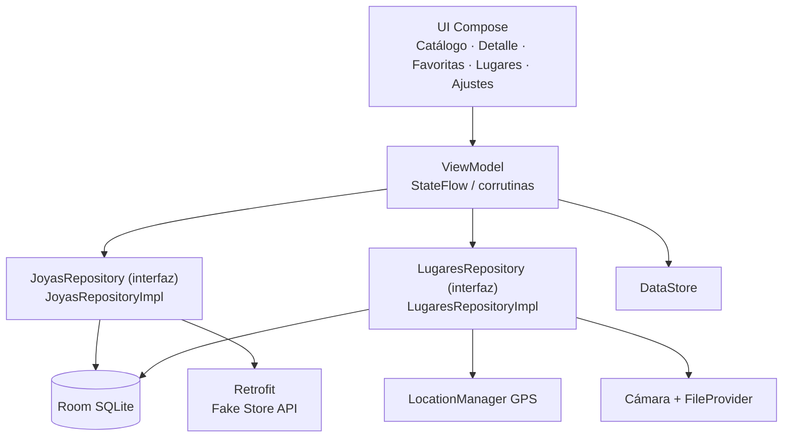
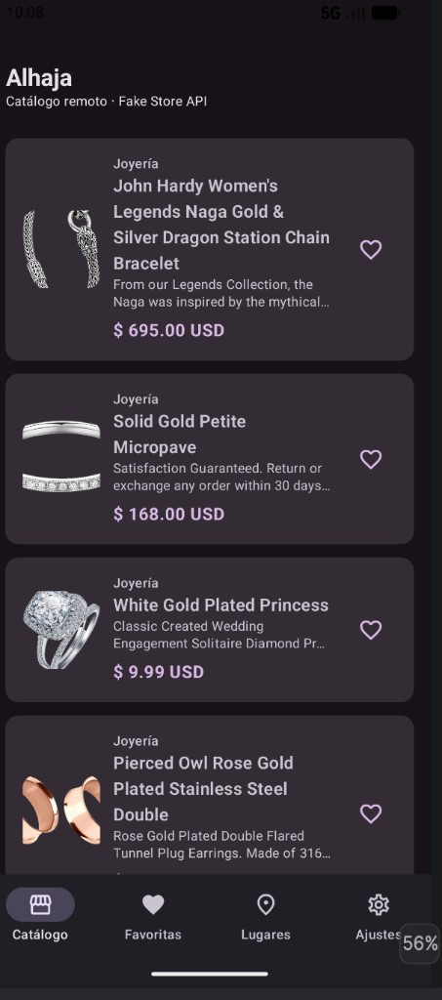
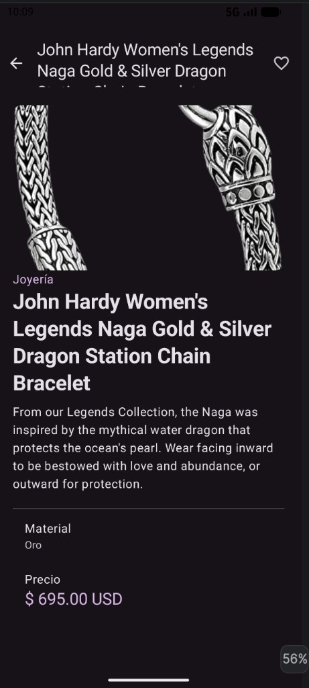
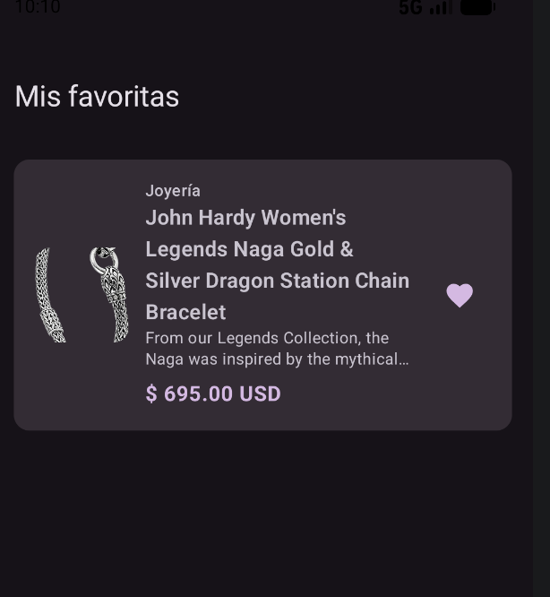
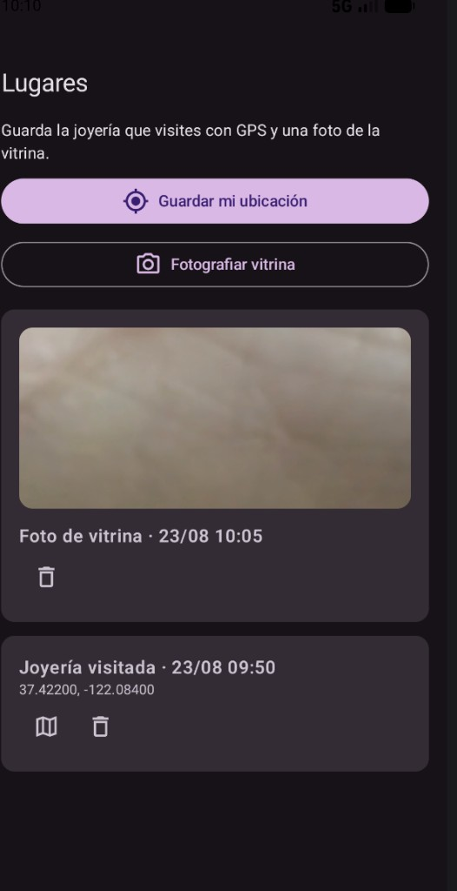
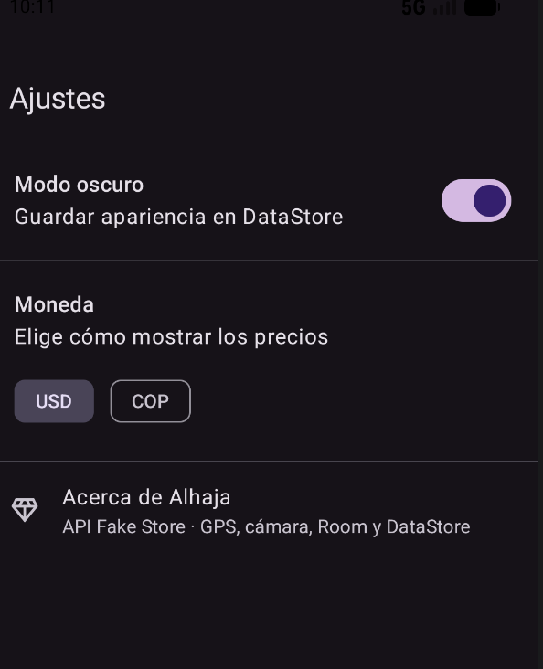

# Alhaja

Catálogo personal de joyería para Android. Exploras piezas remotas, guardas favoritos en el teléfono, ajustas tema y moneda, y registras joyerías visitadas con GPS o una foto de la vitrina.

## Arquitectura



MVVM + Repositorio en tres capas. El `ViewModel` depende solo de **interfaces** declaradas en `domain`; las implementaciones concretas viven en `data`, así que la UI nunca conoce Retrofit, Room ni DataStore.

```text
ui/       Compose + ViewModel
domain/   modelos e interfaces de repositorio
data/     local (Room), remote (Retrofit), preferences (DataStore), hardware (GPS/cámara)
```

| Interfaz en `domain/repository` | Implementación en `data` |
|---|---|
| `JoyasRepository` | `JoyasRepositoryImpl` (Room + Retrofit) |
| `LugaresRepository` | `LugaresRepositoryImpl` (Room + GPS/cámara) |
| `PreferenciasRepository` | `PreferenciasRepositoryImpl` (DataStore) |

```text
UI (Jetpack Compose)
        │
        ▼
   ViewModel
  (StateFlow + viewModelScope)
        │
        ▼
     Repository
   ┌────┼────────────┐
   ▼    ▼            ▼
 Room  Retrofit   DataStore
 Favoritos  Fake Store  Tema / moneda
 Lugares
        ▲
        │
  GPS / Cámara
```



## API utilizada

[Fake Store API](https://fakestoreapi.com/products/category/jewelery) — categoría `jewelery` (ortografía de la API). Pública, gratuita y sin clave.

## Capturas de pantalla

Catálogo remoto con `LazyColumn`, Coil y precios de Fake Store:



Detalle de una pieza (material, precio y favorito):



Favoritas persistidas en Room:



Lugares: GPS y foto de vitrina (la foto pixelada y las coordenadas de California son del emulador, no de la app):



Ajustes con DataStore (modo oscuro y moneda):



## Qué cubre la rúbrica

| Requisito | Implementación |
|---|---|
| Compose + 3+ pantallas | Catálogo, detalle, favoritas, lugares, ajustes |
| LazyColumn | Listas de joyas y de lugares |
| Coil | Fotos remotas y capturas locales |
| MVVM + Repository | `AlhajaViewModel` → interfaz en `domain` → implementación en `data` |
| Room | Favoritos y lugares/fotos |
| DataStore | Modo oscuro y moneda USD/COP |
| Retrofit | Catálogo remoto con carga / éxito / error |
| Hardware | GPS y cámara, con permiso en tiempo de ejecución y caso de rechazo |
| Entrega | `.aab` firmado y `.apk` de prueba |

## Cómo abrir el proyecto

1. Abre la carpeta en Android Studio.
2. Espera el sync de Gradle.
3. Ejecuta la configuración `app` en un emulador o teléfono con ubicación (para GPS).

## Firma de entrega (uso académico)

Keystore local: `keystore/alhaja-upload.jks`

- alias: `alhaja`
- contraseña del almacén y de la clave: `alhaja1234`

No uses estas claves en producción. El `.jks` no debe subirse a un repositorio público.

Generar paquetes:

```bash
./gradlew bundleRelease assembleRelease assembleDebug
```

Archivos de entrega (después de compilar):

- `entrega/Alhaja.aab` — listo para Play Console
- `entrega/Alhaja.apk` — instalación directa para pruebas

## Video de sustentación

Graba 15 minutos mostrando: catálogo con carga/error, detalle, favoritos, DataStore, GPS/cámara con permiso rechazado y concedido, y menciona las capas UI / ViewModel / Repository / Room-Retrofit-DataStore.
